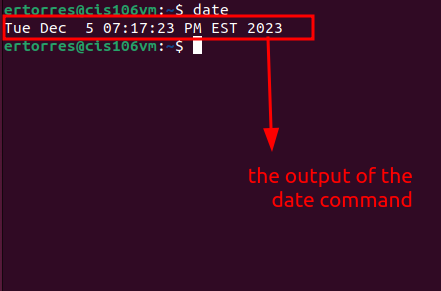
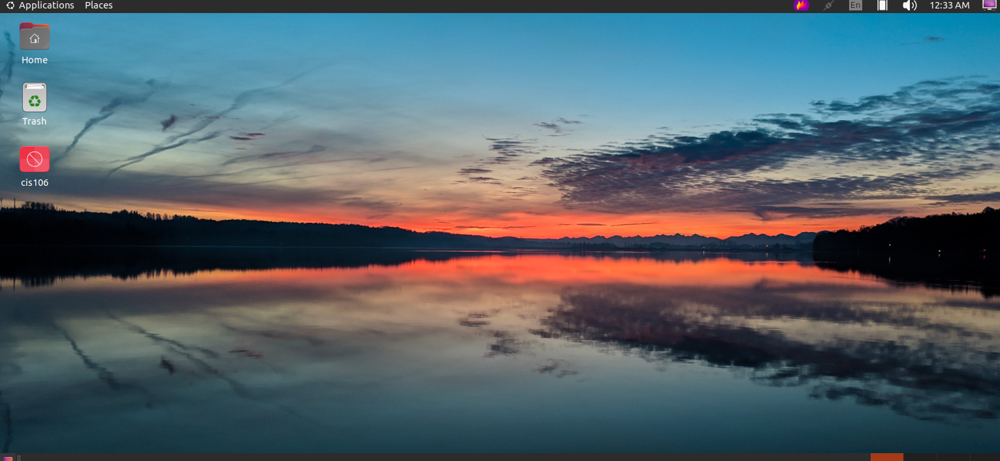

...
name: Ertorres
semester: Fall 2023
Course: CIS106 Linux Fundamentals
...
# Lab 2 Installing Ubuntu Fundamentals

## Question1

## Question2

## Question3

| Program purpose     | Package Name | Version |
| ------------------- | ------------ | ------- |
| Play a tetris game  | petris       |  1.0.1-11  |
| Play a video file   | VLC Media Player|  1.1.0-2   |
| Browse the internet | Mozilla FireFox | 0.22.04.1  |
| Read your email     |      Outlook    |   17.0.14326.20238  |
| Play music          | VLC Media Player|  1.1.0-2   |

command answers
*Sub question 1:'apt search "tetris"'
*Sub question 2:'apt search "video'
*Sub question 3:'apt search "internet"'
*Sub question 4:'apt search "email"'
*Sub question 5:apt search "music"''

## Question 4
| command | what it does |
| ------- | ------------ |
| echo    | display a line of text             |
| fortune | print a random, hopefully interesting, adage            |
| cowsay  | configurable speaking/thinking cow             |
| lolcat  | rainbow coloring effect for text console display             |
| figlet  | display large characters made up of ordinary screen characters             |
| toilet  | display large colourful characters            |
| rig     | Random Identity Generator             |